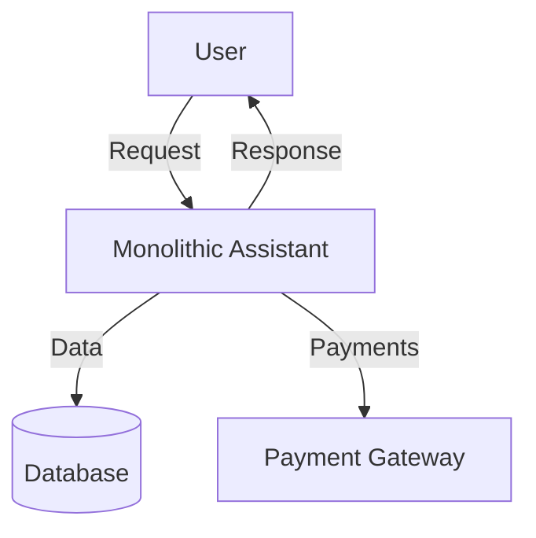

# Marketplace Assistant - Initial Monolithic Application

This is the initial implementation of our AI-powered Marketplace Assistant. It's a monolithic application that handles all aspects of the shopping experience, from product recommendations to delivery estimation, purchase processing, and notifications.

## Architecture

The application is structured as a single monolithic agent that handles multiple responsibilities:
- Understanding user requests
- Product recommendations
- Inventory management
- Purchase processing
- Delivery estimation
- Customer notifications

## Components



## Design Limitations

This initial implementation has several limitations:

1. **High Latency**: The monolithic agent must process all aspects of a user request sequentially.
2. **Token Inefficiency**: The whole context is passed to the LLM for every operation, even for deterministic tasks.
3. **Reliability Issues**: A failure in any component impacts the entire application.
4. **Debugging Complexity**: Difficult to isolate issues within the monolith.
5. **Scalability Challenges**: The entire application needs to scale together.
6. **No Compensation Handling**: When failures occur mid-transaction, the system can be left in an inconsistent state.

### Critical Bug: Inventory Inconsistency

The application has a critical issue that demonstrates the need for proper transaction handling:

1. When a user attempts to purchase a product, the inventory is reduced BEFORE payment processing
2. If the payment fails (simulated 50% of the time), the inventory remains reduced
3. This creates a data inconsistency where products appear out of stock but were never actually purchased
4. In a production system, this would require manual intervention to fix

This bug was deliberately included to demonstrate why compensation handling is necessary in distributed systems, which we'll address in Stage 3 of the workshop.

## Running the Application

1. Install dependencies:
```shell
npm install
```

2. Setup the appplication's data:
```shell
cp data.json-example data.json
```

3. Start the application:
```shell
npm start
```

4. Interact with the assistant via the terminal interface.

## Next Steps

In the next stage, we'll refactor this monolithic application into a multi-agent architecture using [orra](https://github.com/orra-dev/orra) to orchestrate the different specialized agents.
